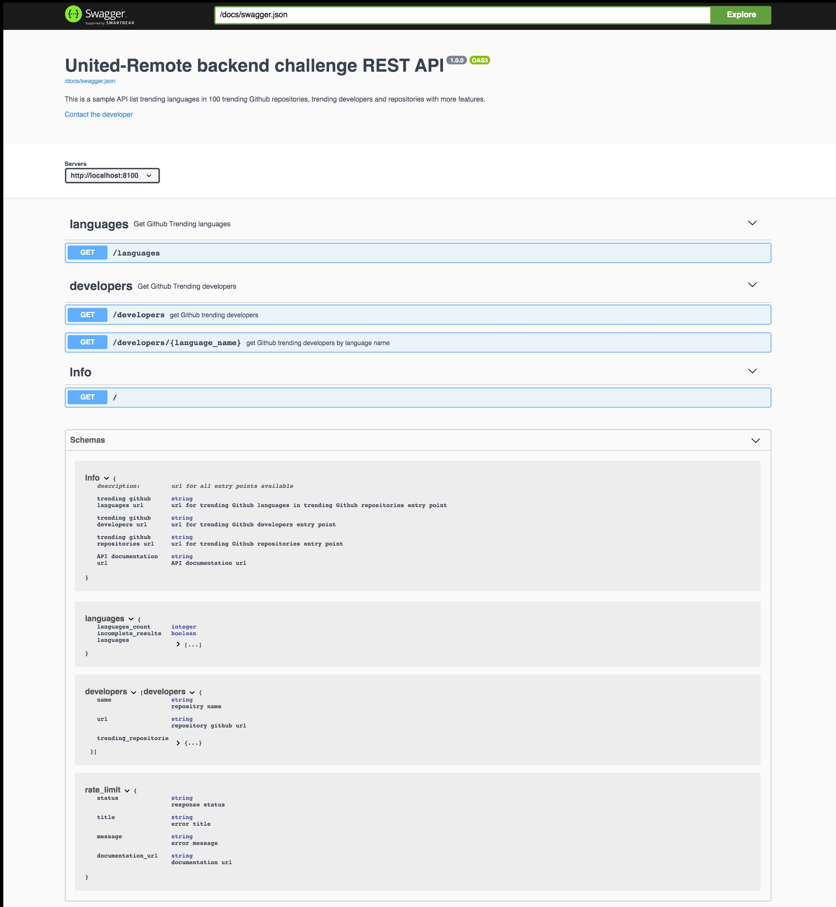

	<h1  align="center">Gemography backend-coding-challenge</h1>

Nouredin Ouhaddou ([rakati](https://github.com/rakati))

Code in this repository is provided under the terms of the [MIT license](https://choosealicense.com/licenses/mit/).

## Table of Contents <!-- omit in toc -->

- [About the challenge](#about-the-challenge)
- [App overview](#app-overview)
- [Technologies used](Technologies-used)
- [Quick Start](#Quick-Start)
  - [Requirements](#requirements)
  - [Install](#Install)
- [Documentation](#Documentation)
- [End Points](#end-points)

## About the challenge

[Gemography backend-coding-challenge](https://github.com/hiddenfounders/backend-coding-challenge) is about creating REST microservice that list the languages used by the 100 trending public repos on GitHub.
- For every language, we need to calculate the attributes below 👇:
    - Number of repos using this language
    - The list of repos using the language
    - Framework popularity over the 100 repositories

## App overview

This is a simple REST API that list the list the languages used by the 100 based on straightforward algorithm which is the most starred repositories created on last month, also the api provide also the trending Github developers.

## Notes
- For Framework popularity over the 100 repositories the github API doesn't provide repository framework, so I didn't do it.

## Technologies used

	- Flask			: lightweight WSGI web application framework
	- Flask-limiter 	: for rate limiting
	- Flask-swagger-ui	: for the documentation
	- Flask-caching		: for caching responses

## Quick Start

### Requirements
	- Docker
	- Web browser (chrome)
### Install
1. clone the project
	`git clone https://github.com/rakati/United-remote_Backend_challenge.git`
2. cd into project directory
	`cd United-remote_Backend_challenge`
3. Build docker image of the API
	`docker build -t flaskapp .`
4. Run the docker container
	`docker run -it -d -p 8100:8100 flaskapp`

Now the API is working on [http://localhost:8100/](http://localhost:8100/)

## Documentation

The documenation is built with Swagger UI, A beautiful and interactive documentation
check this url [documentation](http://localhost:8100/docs)

## Entry points
| Entry point | description|
|-------------|-----------|
|/        	  | get global info|
|/languages   | list all languages in 100 trending github repos
|/developers  | list github trending developers (optional query since=['daily', 'weekly', 'monthly])
|/developers/language  | list github trending developers by language (optional query since=['daily', 'weekly', 'monthly])